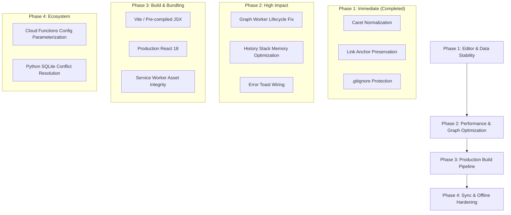

# KeepIt Codebase Audit & Architectural Review

**Date:** September 18, 2026  
**Repository:** [KeepIt](https://github.com/TPiatek360/KeepIt.git)  
**Version:** v2.1.0+  

---

## 1. Executive Summary

KeepIt is a hybrid web and desktop note-taking application designed around Google Keep-inspired aesthetics, markdown storage, bi-directional note linking (`::shortId` / `internal://`), rich checklists, an interactive force-directed graph view, and a Python-based offline SQLite distribution (`PythonDistro`).

The architecture leverages a single `contenteditable` host for unified inline checklist and rich-text editing, paired with Firestore real-time synchronization, IndexedDB offline caching, and PWA capabilities. While the core feature set is rich and responsive, several subtle DOM synchronization edge cases, runtime performance bottlenecks, and architectural limitations exist.

---

## 2. Recent Issues Diagnosed & Resolved

### Bug 1: Checklist Caret Behind Checkbox
- **Symptom:** When creating a new note or list item and pressing `Enter`, the cursor appeared *behind* the newly created checkbox (to its left, between the grip handle and checkbox) instead of inside the editable text area. Typing in this state inserted text into the parent `<li>` flex container, corrupting the document hierarchy.
- **Root Cause:** In Chromium/WebKit, setting a DOM range to offset `0` of an inline `<span class="task-content"><br></span>` element that has sibling `contenteditable="false"` elements (`task-handle`, `task-checkbox`) causes the browser's caret canonicalizer to collapse to the preceding element boundary (the `<li>` container). Additionally, calling `editorRef.current.focus()` immediately after `selection.addRange()` forced the browser to re-normalize selection to the start of the block.
- **Fix Applied:**
  - Implemented `setCaretInContent(contentEl, atStart)` in [`public/js/components/editor.js`](file:///C:/Users/TPiatek360/OneDrive/Documents/Web%20Pages/Note%20App/public/js/components/editor.js). This creates or locates an explicit `TextNode` inside `.task-content` or `.bullet-content`, placing the range strictly inside the text leaf node.
  - Updated `handleKeyDown` (Enter key), `onInsertChecklist`, `onInsertBulletList`, and `handleEditorClick` to use `setCaretInContent`.
  - Updated `enforceSelection` to automatically relocate any stray collapsed caret on the `<li>` element or uneditable spans back into the text content node.

### Bug 2: Link Insertion Overwriting Highlighted Text
- **Symptom:** Highlighting text (e.g., `"Monocular Depth Estimation"`), selecting "Insert Link", and entering a note ID (e.g., `::oxbg`) caused the link to be created with the ID as its anchor text placed immediately before the unlinked highlighted text (`::oxbgMonocular Depth Estimation`).
- **Root Cause:**
  1. Clicking the toolbar's "Insert Link" button could cause the browser selection to collapse to a caret immediately before the highlighted text before the modal opened.
  2. If the pending span had empty text content, the modal's `onSubmit` handler inserted the URL/ID directly into the span.
  3. `parseMarkdown` and `processInlineFormatting` in [`public/js/utils.js`](file:///C:/Users/TPiatek360/OneDrive/Documents/Web%20Pages/Note%20App/public/js/utils.js) only attached `class="internal-link"` to bare `::id` syntax, omitting the class from markdown-formatted internal links like `[Label](internal://id)`.
- **Fix Applied:**
  - Continuously track and preserve non-collapsed selections in `selectionRef.current` via `enforceSelection`.
  - In `onInsertLink`, inspect both live selection and `selectionRef.current`. If text was highlighted, capture the text into `data-selected-text`.
  - In `onSubmit`, if text was highlighted, preserve that text as the anchor text: `<a href="${finalUrl}" class="internal-link">${finalText}</a>`.
  - Updated `window.processInlineFormatting` in `utils.js` to assign `class="internal-link"` to any `[text](internal://id)` link so internal links with custom labels retain full preview and navigation capabilities.

### Bug 3: Graph View Worker Churn & Edge Case-Insensitivity (Resolved)
- **Symptom:** During graph panning or wheel-zooming, Web Workers were being continuously created and terminated at 60 FPS. Also, internal links targeting full 20-char mixed-case Firestore IDs failed to connect edges.
- **Fix Applied:**
  - In [`public/js/components/graph-view.js`](file:///C:/Users/TPiatek360/OneDrive/Documents/Web%20Pages/Note%20App/public/js/components/graph-view.js), the Web Worker is now instantiated once on mount (`[]`) and persists across the component lifetime, with latest viewport and layout callback references maintained via React refs.
  - Edge target note matching now tests `(n.id && n.id.toLowerCase() === targetId)` so full IDs resolve case-insensitively alongside short IDs.

---

## 3. High-Priority Findings & Recommended Fixes

### 2. Runtime In-Browser Babel Compilation (`@babel/standalone`)
- **Location:** [`public/index.html`](file:///C:/Users/TPiatek360/OneDrive/Documents/Web%20Pages/Note%20App/public/index.html#L46-L79)
- **Issue:** All 10 application components (`app.js`, `editor.js`, `cards.js`, `graph-view.js`, etc.) use `<script type="text/babel">` and are transpiled in real-time on every page load by Babel running in the browser. Furthermore, `react.development.js` and `react-dom.development.js` are loaded instead of production bundles.
- **Impact:**
  - Initial load time is 3x–5x slower, especially on mobile devices.
  - Increased battery and memory consumption.
  - Development warnings in console and larger script bundle transfers.
  - Offline PWA functionality is vulnerable if Babel or CDN assets fail to cache properly.
- **Recommendation:** Introduce a lightweight bundler (such as Vite or esbuild) or a simple build script to pre-compile JSX and bundle dependencies for production.

---

### 3. Cloud Functions Hardcoded Application Namespace
- **Location:** [`functions/index.js`](file:///C:/Users/TPiatek360/OneDrive/Documents/Web%20Pages/Note%20App/functions/index.js#L18)
- **Issue:** 
  ```javascript
  exports.onNoteReminderWrite = onDocumentWritten("artifacts/keepit-local/users/{uid}/notes/{noteId}", async (event) => ...
  ```
  The Firestore path is hardcoded to `artifacts/keepit-local/`. If the application ID is changed in settings or deployed to production under a different workspace/tenant, scheduled task reminders via Google Cloud Tasks will fail silently.
- **Recommendation:** Parameterize the path prefix using Firebase environment configuration (`process.env.APP_ID || "keepit-local"`).

---

### 4. Silent Error Swallowing in Storage & Contexts
- **Location:** [`public/js/contexts.js`](file:///C:/Users/TPiatek360/OneDrive/Documents/Web%20Pages/Note%20App/public/js/contexts.js)
- **Issue:** Several critical asynchronous operations (such as IndexedDB access, tag updates, and cache hydration) use empty `catch (err) {}` or generic `console.warn` blocks without surfacing feedback to the UI or logging diagnostic details.
- **Recommendation:** Connect error handlers to the application toast notification system (`setToast({ message: '...', type: 'error' })`) and log structured errors for easier debugging.

---

### 5. Undo/Redo Memory Overhead
- **Location:** [`public/js/components/editor.js`](file:///C:/Users/TPiatek360/OneDrive/Documents/Web%20Pages/Note%20App/public/js/components/editor.js#L143-L155)
- **Issue:** The editor saves a complete snapshot of the document's `innerHTML`, `content`, and metadata on every debounced keystroke, persisting up to 50 snapshots in React state and in `localStorage` under `note_history_${incomingId}`. For large notes with embedded base64 images or extensive task lists, this can exceed `localStorage` quotas (typically 5MB).
- **Recommendation:**
  - Store only markdown text diffs or pure markdown strings rather than full `innerHTML` trees.
  - Strip large media strings (data URLs) from history snapshots.

---

## 4. Architectural Roadmap



---

## 5. Security & Privacy Audit

- **Repository Protection:** Confirmed that `.gitignore` prevents SQLite databases (`PythonDistro/notes_db.sqlite`), JSON backups (`keepit_backup*.json`), local environment variables (`.env*`), and Python cache files from being tracked or pushed to remote repositories.
- **Firebase Security Rules:** Ensure `firestore.rules` enforces user UID isolation (`request.auth.uid == uid`) to prevent cross-user note leakage when online sync is activated.
