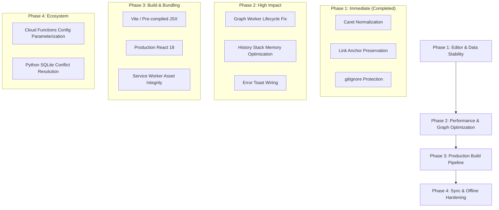

# KeepIt Codebase Audit & Architectural Review

**Date:** September 18, 2026  
**Repository:** [KeepIt](https://github.com/TPiatek360/KeepIt.git)  
**Version:** v2.1.0+  

---

## 1. Executive Summary

KeepIt is a hybrid web and desktop note-taking application designed around Google Keep-inspired aesthetics, markdown storage, bi-directional note linking (`::shortId` / `internal://`), rich checklists, an interactive force-directed graph view, and a Python-based offline SQLite distribution (`PythonDistro`).

The architecture leverages a single `contenteditable` host for unified inline checklist and rich-text editing, paired with Firestore real-time synchronization, IndexedDB offline caching, and PWA capabilities. While the core feature set is rich and responsive, several subtle DOM synchronization edge cases, runtime performance bottlenecks, and architectural limitations exist.

---

## 2. Recent Issues Diagnosed & Resolved

### Bug 1: Checklist Caret Behind Checkbox
- **Symptom:** When creating a new note or list item and pressing `Enter`, the cursor appeared *behind* the newly created checkbox (to its left, between the grip handle and checkbox) instead of inside the editable text area. Typing in this state inserted text into the parent `<li>` flex container, corrupting the document hierarchy.
- **Root Cause:** In Chromium/WebKit, setting a DOM range to offset `0` of an inline `<span class="task-content"><br></span>` element that has sibling `contenteditable="false"` elements (`task-handle`, `task-checkbox`) causes the browser's caret canonicalizer to collapse to the preceding element boundary (the `<li>` container). Additionally, calling `editorRef.current.focus()` immediately after `selection.addRange()` forced the browser to re-normalize selection to the start of the block.
- **Fix Applied:**
  - Implemented `setCaretInContent(contentEl, atStart)` in [`public/js/components/editor.js`](file:///C:/Users/TPiatek360/OneDrive/Documents/Web%20Pages/Note%20App/public/js/components/editor.js). This creates or locates an explicit `TextNode` inside `.task-content` or `.bullet-content`, placing the range strictly inside the text leaf node.
  - Updated `handleKeyDown` (Enter key), `onInsertChecklist`, `onInsertBulletList`, and `handleEditorClick` to use `setCaretInContent`.
  - Updated `enforceSelection` to automatically relocate any stray collapsed caret on the `<li>` element or uneditable spans back into the text content node.

### Bug 2: Link Insertion Overwriting Highlighted Text
- **Symptom:** Highlighting text (e.g., `"Monocular Depth Estimation"`), selecting "Insert Link", and entering a note ID (e.g., `::oxbg`) caused the link to be created with the ID as its anchor text placed immediately before the unlinked highlighted text (`::oxbgMonocular Depth Estimation`).
- **Root Cause:**
  1. Clicking the toolbar's "Insert Link" button could cause the browser selection to collapse to a caret immediately before the highlighted text before the modal opened.
  2. If the pending span had empty text content, the modal's `onSubmit` handler inserted the URL/ID directly into the span.
  3. `parseMarkdown` and `processInlineFormatting` in [`public/js/utils.js`](file:///C:/Users/TPiatek360/OneDrive/Documents/Web%20Pages/Note%20App/public/js/utils.js) only attached `class="internal-link"` to bare `::id` syntax, omitting the class from markdown-formatted internal links like `[Label](internal://id)`.
- **Fix Applied:**
  - Continuously track and preserve non-collapsed selections in `selectionRef.current` via `enforceSelection`.
  - In `onInsertLink`, inspect both live selection and `selectionRef.current`. If text was highlighted, capture the text into `data-selected-text`.
  - In `onSubmit`, if text was highlighted, preserve that text as the anchor text: `<a href="${finalUrl}" class="internal-link">${finalText}</a>`.
  - Updated `window.processInlineFormatting` in `utils.js` to assign `class="internal-link"` to any `[text](internal://id)` link so internal links with custom labels retain full preview and navigation capabilities.

### Bug 3: Graph View Worker Churn & Edge Case-Insensitivity (Resolved)
- **Symptom:** During graph panning or wheel-zooming, Web Workers were being continuously created and terminated at 60 FPS. Also, internal links targeting full 20-char mixed-case Firestore IDs failed to connect edges.
- **Fix Applied:**
  - In [`public/js/components/graph-view.js`](file:///C:/Users/TPiatek360/OneDrive/Documents/Web%20Pages/Note%20App/public/js/components/graph-view.js), the Web Worker is now instantiated once on mount (`[]`) and persists across the component lifetime, with latest viewport and layout callback references maintained via React refs.
  - Edge target note matching now tests `(n.id && n.id.toLowerCase() === targetId)` so full IDs resolve case-insensitively alongside short IDs.

### Bug 4: Undo (Ctrl+Z) Caret Jump & Debounce Desynchronization (Resolved)
- **Symptom:** After modifying a note, pressing `Ctrl+Z` caused the caret to jump to the very beginning of the note instead of near the edit or at the end. On checklist notes, the caret landed behind the checkbox of the first item at the top of the note or inside an uneditable handle.
- **Root Cause:**
  1. `applyHistoryState` previously attempted to compute an offset from the *current* DOM state (which had more characters if content was added). If `offset > charCount` of the restored snapshot, `found` was `false`, leaving the browser selection unset. The browser then defaulted to `(0, 0)` of the editor.
  2. Because the first node was often `<li class="task-line">`, `enforceSelection` caught the selection at the root of that list item and repositioned it to the beginning of the first list item (or left it behind the checkbox).
  3. Active typing changes within the 500ms debounce window were not flushed before undoing, causing `Ctrl+Z` to skip states or do nothing when `historyIndex === 0`.
- **Fix Applied:**
  - In [`public/js/components/editor.js`](file:///C:/Users/TPiatek360/OneDrive/Documents/Web%20Pages/Note%20App/public/js/components/editor.js):
    - Added `getEditorCaretOffset()` and `restoreEditorCaret(offset)` using a `TreeWalker` that strictly measures editable text nodes and filters out non-editable handles/checkboxes/buttons.
    - Added `placeCaretAtEnd(editorEl)` to reliably anchor the caret at the end of the note (inside `.task-content` or `.bullet-content` if the note ends with a list item).
    - Updated `pushToHistory` to record `caretOffset` with each snapshot.
    - Updated `applyHistoryState` to attempt restoration using `state.caretOffset`, with automatic fallback to `placeCaretAtEnd()`.
    - Implemented `flushPendingHistory()` on `handleUndo` and `handleRedo` to capture uncommitted keystrokes within the debounce window before undoing.
    - Added `Ctrl+Shift+Z` support alongside `Ctrl+Y` for Redo.

### Bug 5: Missing On-Demand Link Preview Stub Generation (Resolved)
- **Symptom:** Previously, adding or viewing links in notes lacked an option to insert a rich preview stub card below the hyperlink on demand. Automatic generation on paste was unwanted, but clicking an existing link lacked an "Add Preview" button next to Edit.
- **Fix Applied:**
  - In [`public/js/utils.js`](file:///C:/Users/TPiatek360/OneDrive/Documents/Web%20Pages/Note%20App/public/js/utils.js):
    - Extended `parseMarkdown` to parse `> **[Title](url)**\n> Snippet` blockquotes into rich preview cards (`.link-preview-card`) featuring an icon, title, target domain/ID, and an interactive delete button (`×`).
    - Added general markdown blockquote (`> `) rendering.
  - In [`public/js/components/editor.js`](file:///C:/Users/TPiatek360/OneDrive/Documents/Web%20Pages/Note%20App/public/js/components/editor.js):
    - Added an "Add Preview Stub" button (`<Icons.Eye />`) directly inside the link popover toolbar alongside the "Edit Link" button.
    - Implemented `handleAddPreview` which resolves internal note titles/snippets or target URLs, creates the preview stub node directly underneath the link's line, and registers changes in history.
    - Updated `parseHtmlToMarkdown` to preserve preview cards bi-directionally without breaking contenteditable flow.
    - Handled inline `.preview-delete-btn` clicks to easily dismiss preview cards.

### Bug 6: Graph View Mobile Single-Finger Scrolling & Multi-Touch Pinch (Resolved)
- **Symptom:** On mobile touchscreens, single-finger panning on the Graph View canvas did not work reliably or at all, while two-finger pinch-to-zoom was erratic or only worked via trackpad wheel emulation.
- **Root Cause:** In `handlePointerDown`, canvas drag was restricted by `e.target === canvasRef.current`. Because the transformed world container, SVG layer, and background grid covered the entire canvas area, `e.target` was a child container rather than `canvasRef.current`, causing single-finger touches to be completely ignored.
- **Fix Applied:**
  - In [`public/js/components/graph-view.js`](file:///C:/Users/TPiatek360/OneDrive/Documents/Web%20Pages/Note%20App/public/js/components/graph-view.js):
    - Replaced the brittle `e.target === canvasRef.current` equality check with an exclusion check (`!e.target.closest('[data-node-id], .edge-popover, .snapshots-menu, button, select, input')`). Any touch/click on empty canvas space now initiates smooth panning.
    - Added `activePointersRef` (Map of pointer IDs) to track multiple touch contacts simultaneously.
    - Implemented native multi-touch 2-finger pinch-to-zoom and 2-finger pan, calculating pinch distance ratios and midpoint translations.
    - Added `touch-none` and `onPointerCancel={handlePointerUp}` to prevent browser-native scrolling conflicts.

### Bug 7: Graph View Tag Drag-and-Drop Reparenting (Resolved)
- **Symptom:** On both mobile and desktop, dragging a tag node onto another tag node only triggered force-separation collision avoidance (`findFreePos`), failing to establish a parent-child relationship. Creating tag hierarchies required dragging a 16px hover crosshair dot that was impossible to use on touch screens.
- **Root Cause:** Node dragging (`draggingNode`) and node linking (`connectingNode`) were completely decoupled. Dropping a node ran collision pushback instead of detecting drop targets. Furthermore, tapping a node without moving it still triggered collision resolution, causing inadvertent node position shifts.
- **Fix Applied:**
  - In [`public/js/components/graph-view.js`](file:///C:/Users/TPiatek360/OneDrive/Documents/Web%20Pages/Note%20App/public/js/components/graph-view.js):
    - Added `dropTargetId` state and real-time hover target detection during node drag using `document.elementsFromPoint(e.clientX, e.clientY)`.
    - Added drop-target visual highlight styling (`ring-4 ring-emerald-500 scale-110 z-30 shadow-2xl`) when hovering over a viable target.
    - In `handlePointerUp`, if a single node is dragged over another node (distance > 10px):
      - **Tag dropped onto Tag:** Calls `onTagOperation(childTag, parentTag, true)` to reparent the tag and establish the hierarchy edge immediately.
      - **Tag dropped onto Note / Note dropped onto Tag:** Calls `onAddTag(noteId, tag)` to tag the note.
      - Settles the dragged node smoothly next to the target node without overlap.
    - Added a 4px drag threshold to differentiate taps/clicks from actual drags, eliminating accidental node position shifts on selection taps.

### Bug 8: Unlabeled Graph Relationship Edges (Resolved)
- **Symptom:** Custom note-to-note links (*"Related to"*, *"Expands"*, *"Causes"*, *"Prevents"*, *"Explains"*) and internal links appeared as uniform solid or dashed lines. Users could not determine the type of relationship between notes without individually clicking each edge line.
- **Fix Applied:**
  - In [`public/js/components/graph-view.js`](file:///C:/Users/TPiatek360/OneDrive/Documents/Web%20Pages/Note%20App/public/js/components/graph-view.js):
    - Added `showEdgeLabels` state (persisted in `localStorage`) and a toolbar toggle button (`<Icons.Tag size={18} />`).
    - Added `getEdgeLabel(rel)` resolving forward relationship names for custom note relations, `"link"` for internal markdown links, and `"child of"` for tag hierarchies.
    - Rendered interactive SVG pill badges at the cubic bezier midpoint `(cx, cy)` of connection curves with theme-aware styling and color-matched borders.
    - Clicking the pill directly triggers `handleEdgeClick` to edit or delete the link.
    - Included zoom-distance thresholding (`scale >= 0.35` and node distance >= 70px) to prevent badge crowding when zoomed far out.

### Bug 9: History Stack & LocalStorage Quota Overflow (Resolved)
- **Symptom:** On notes with embedded base64 screenshots, drawing canvas sketches, or extensive task lists, saving up to 50 raw HTML snapshots to `localStorage` caused `QuotaExceededError` crashes and blocked settings/draft saves. Additionally, historical keys for inactive notes accumulated indefinitely.
- **Fix Applied:**
  - In [`public/js/components/editor.js`](file:///C:/Users/TPiatek360/OneDrive/Documents/Web%20Pages/Note%20App/public/js/components/editor.js):
    - Implemented `sanitizeHistoryForStorage` to strip heavy base64 `data:image/...` strings from persisted HTML states, capping storage history to the latest 30 snapshots and omitting bloated HTML strings over 40KB in favor of pure markdown content.
    - Implemented `safePersistHistory` with automatic LRU cleanup: if quota limits are approached, all stale `note_history_*` entries for inactive notes are purged and the payload is retried with reduced states.
    - Added automatic pruning of expired (> 24h) or unparseable history keys on note initialization.

### Feature 10: KeepIt REST API & Personal Access Tokens (v1) (Implemented)
- **Objective:** Enable external applications, automation tools, and scripts (such as iOS Shortcuts, Raycast, Obsidian, scripts, and home automation systems) to programmatically query, create, update, search, and manage notes and tags in KeepIt.
- **Architecture & Implementation:**
  - **Cloud Function REST API (`functions/api.js`):**
    - Built an Express-based REST API hosted on Firebase Cloud Functions (`api`), served via Firebase Hosting rewrite `/api/**`.
    - Endpoints:
      - `GET /v1/notes` (supports query filters: `tag`, `search`, `pinned`, `archived`, `trashed`, `limit`).
      - `GET /v1/notes/:id` (supports lookup by doc ID or 4-character `shortId`).
      - `POST /v1/notes` (generates collision-resistant `shortId`, normalizes tags, sets timestamps).
      - `PATCH /v1/notes/:id` (supports updating fields, `appendContent`, `addTags`, `removeTags`).
      - `DELETE /v1/notes/:id` (soft-delete to trash by default, or permanent deletion with `?permanent=true`).
      - `GET /v1/tags` (returns all unique tags).
      - `GET /v1/me` (identity and authentication token status).
      - `GET /v1/keys`, `POST /v1/keys`, `DELETE /v1/keys/:keyId` (Personal Access Token management).
      - `GET /v1/docs` (interactive, responsive API documentation reference).
  - **Authentication & Security:**
    - Dual authentication support: Personal API Keys (`X-API-Key` or `Authorization: Bearer keepit_sk_...`) and Firebase Auth ID tokens (`Authorization: Bearer <jwt>`).
    - API keys are hashed with SHA-256 before storage (`artifacts/${APP_ID}/api_keys/${hash}`). The raw secret key is never stored in Firestore and is displayed to the user only once upon creation.
    - Parameterized namespace prefix `APP_ID = process.env.APP_ID || "keepit-local"`.
  - **Settings UI (`public/js/components/modals.js`):**
    - Added an "API & Developer" tab to the Settings Modal.
    - Provides Base URL copy utility, API key generation with custom labels, one-time key reveal card, active keys list with revocation, and quick-start cURL examples.

---

## 3. High-Priority Findings & Recommended Fixes

### 2. Runtime In-Browser Babel Compilation (`@babel/standalone`)
- **Location:** [`public/index.html`](file:///C:/Users/TPiatek360/OneDrive/Documents/Web%20Pages/Note%20App/public/index.html#L46-L79)
- **Issue:** All 10 application components (`app.js`, `editor.js`, `cards.js`, `graph-view.js`, etc.) use `<script type="text/babel">` and are transpiled in real-time on every page load by Babel running in the browser. Furthermore, `react.development.js` and `react-dom.development.js` are loaded instead of production bundles.
- **Impact:**
  - Initial load time is 3x–5x slower, especially on mobile devices.
  - Increased battery and memory consumption.
  - Development warnings in console and larger script bundle transfers.
  - Offline PWA functionality is vulnerable if Babel or CDN assets fail to cache properly.
- **Recommendation:** Introduce a lightweight bundler (such as Vite or esbuild) or a simple build script to pre-compile JSX and bundle dependencies for production.

---

### 3. Cloud Functions Hardcoded Application Namespace
- **Location:** [`functions/index.js`](file:///C:/Users/TPiatek360/OneDrive/Documents/Web%20Pages/Note%20App/functions/index.js#L18)
- **Issue:** 
  ```javascript
  exports.onNoteReminderWrite = onDocumentWritten("artifacts/keepit-local/users/{uid}/notes/{noteId}", async (event) => ...
  ```
  The Firestore path is hardcoded to `artifacts/keepit-local/`. If the application ID is changed in settings or deployed to production under a different workspace/tenant, scheduled task reminders via Google Cloud Tasks will fail silently.
- **Recommendation:** Parameterize the path prefix using Firebase environment configuration (`process.env.APP_ID || "keepit-local"`).

---

### 4. Silent Error Swallowing in Storage & Contexts
- **Location:** [`public/js/contexts.js`](file:///C:/Users/TPiatek360/OneDrive/Documents/Web%20Pages/Note%20App/public/js/contexts.js)
- **Issue:** Several critical asynchronous operations (such as IndexedDB access, tag updates, and cache hydration) use empty `catch (err) {}` or generic `console.warn` blocks without surfacing feedback to the UI or logging diagnostic details.
- **Recommendation:** Connect error handlers to the application toast notification system (`setToast({ message: '...', type: 'error' })`) and log structured errors for easier debugging.

---

## 4. Architectural Roadmap



---

## 5. Security & Privacy Audit

- **Repository Protection:** Confirmed that `.gitignore` prevents SQLite databases (`PythonDistro/notes_db.sqlite`), JSON backups (`keepit_backup*.json`), local environment variables (`.env*`), and Python cache files from being tracked or pushed to remote repositories.
- **Firebase Security Rules:** Ensure `firestore.rules` enforces user UID isolation (`request.auth.uid == uid`) to prevent cross-user note leakage when online sync is activated.
